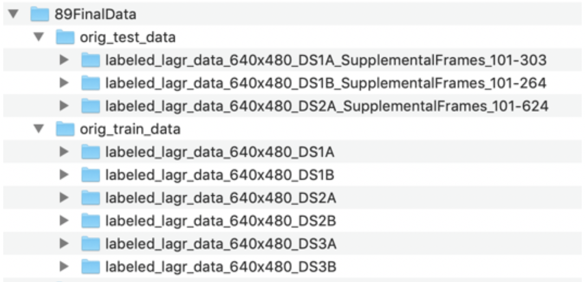

Introduction 
=============

In recent years, autonomous vehicle navigation has been focused on road-based vehicles. This popularity is warranted by the enormous demand for safe and reliable travel and will continue to progress. Advances in robotics have extended beyond being able to assist humans with road-based travel needs. Modern robots have the ability to maneuver over complex natural landscapes like humans and animals can do. This brings the benefits of automated machinery to a much broader scope of applications such as farming, military, security, search and rescue, etc.

The PathFinder project aims to teach off-road autonomous vehicles how to determine navigable paths. PathFinder is a deep learning-based application that will develop a heatmap from an image of a landscape that highlights navigable areas.

> **Problem Statement:**
>
> *“Provide ground-based autonomous vehicles and robots support with understanding their surroundings in order to select an adequate navigable path using a model of Autoencoders and Convolutional Neural Networks trained using Keras with a sample videos from a variety of landscapes and lighting conditions.”*

Overview 
=========

The project is divided into 3 distinct efforts;

1.  data handling

2.  model development and training,

3.  using the model to display the heat maps

The training data for the model will originate from <http://www.mikeprocopio.com/labeledlagrdata.html>. The initial research project was focused on enhancing robotic navigation using stereoscopic visual which is beyond the scope of this project. The PathFinder project will be limited to identifying a path of travel with a single-plane image.

The source data is packed into various series of MAT files which include various pieces of data for each frame in a video sequence. After downloading the data, some of this data is extracted and used for training and testing our PathFinder application. The training data includes an image and a mask that highlights navigable areas. The testing data includes images without any mask.

Each MAT file represents a single frame of video. The image files need to be extracted and stitched together in order to create a video. The video is a sequence showing the navigation of a path. The PathFinder program will create videos with mask overlays that show the navigable elements of the scene. For testing data, the mask will be generated by our model and overlaid on the training video.

The amount of data images available is limited, so training will rely on augmentation.

After several trial and errors, the final model chosen to train the network is an AutoEncoder using CNN layers, image augmentation, no regularization and is trained on color images.

Once training is complete, the trained model will be used to produce a heatmap that highlights navigable areas of a test video sequence.

Description of Technology
=========================

Pathfinder is based on Python using py scripts to support a Jupyter notebook that will execute the whole project.

Keras is used to develop and train models. CNN layers are stacked to create an encoded layer that is expanded back to the original size except the expanded image represents a mask that highlights navigable areas.

Image augmentation is used which drives the use of data generators.

OpenCV is used to produce videos.

Description of Hardware
=======================

Computer: iMac (Retina 5k, 2017)

Processor: 4.2 GHz Intel Core i7, 24GB

GPU: Razer Core X Case with AMD Radeon RX Vega 64 External GPU Card

Using a GPU is imperative to process the data in this project. When attempting to execute some of the steps using CPU’s, the kernel would fail.

Since macOS Mojave, macOS only supports AMD GPU cards. TensorFlow only works on Nvidia cards so in order to use Tensorflow with a GPU, macOS HighSierra or earlier is needed. In order to use an eGPU with macOS Mojave, the PlaidML backend with Keras is necessary. As a result, the master notebook includes a line that will enable the PlaidML backend for Keras. This can be commented out as needed but can be left as-is without problems. If running the project where an Nvidia eGPU is used, this line should be commented out.

Description of Data
===================

A ‘toy\_data’ directory provided with the project includes an extremely limited number of stripped down training images. For best results, it is recommended to download the entire data set. The examples below are form the original dataset. Output will vary when using the toy data.

Each of the 6 training videos has a sequence of 100 frames for a total of 600 training images. Each frame of the test sequences has a corresponding labeled overlay which will be referred to as a mask. Each pixel of each mask is marked as either ‘ground plane’ = 0, ‘obstacle’ = 1 or ‘unidentified’ = 2.

Each of the test scenes has a total of 500 frames each with no overlay information.

Frame Files
-----------

Each directory contains several files where each file represents a frame of video. The file format of each frame is “\*.mat” which includes several pieces of extractable information related to the frame. The data in each MAT file is a dictionary with the following keys:

<code>
\_\_header\_\_

\_\_version\_\_

\_\_globals\_\_

im\_disparity

im\_rgb

stereo\_diff\_disparity

stereo\_disparity\_valid

stereo\_max\_disparity

stereo\_min\_disparity

frame\_number\_a

frame\_number\_b

frame\_number\_c

image\_timestamp

extract\_timestamp

extract\_author

extract\_version

stereo\_mask\_precalc

feature\_image\_precalc

manual\_human\_labeling\_mask
</code>

For the scope of this project, we will focus on the data in ‘im\_rgb’ and ‘manual\_human\_labeling\_task’ where the ‘im\_rgb’ data is the source image and the ‘manual\_human\_labeling\_task’ data is the respective mask.

The ‘im\_rgb’ data frames have a resolution of 640x480 with 3 color layers (RGB Tensorflow ordering).

The ‘manual\_human\_labeling\_task’ frames have a resolution of 640x480 with 1 layer.

Each frame will be treated as a unique image for training purposes and not as a sequential video. For this series of images (which can be combined to make a video), the outcome of any frame is not dependent on the previous one so no sequential analysis effort is necessary. Each frame can be considered a unique image and training does not need to be sequential.

Figure : Mask Overlay

Modifications to Mask Data
--------------------------

Masks from the original data set include a label for each pixel of 0,1 or 2 (‘ground plane’ = 0, ‘obstacle’ = 1 or ‘unidentified’ = 2). We are really just interested in things that are ground plane or not. If something is unidentified, we will assume that it is not navigable. Since we are looking for a path, we don’t want it to be labeled with 0, but rather with a 1. In order to achieve this, we will need to change our masks so that they are composed of 0’s or 1’s only and so that the 1 represents the path.

This makes the masks binary and reduces the amount of data that needs to be processed.

Directory Structure
-------------------

The instructions below will explain how to setup an initial directory structure for the program data. Then, the user will extract the program. The data directory and the program files do not need to be in the same directory structure. Upon executing the program, a series of support directories will be created in the data directory. the downloaded data will be used to create training and validation data sets of images and masks. The setup process will also create a series of videos for each of the training sequences. A ‘results’ directory will be created to store training results.

Installation, Configuration and Setup 
======================================

A – Download Source Data
------------------------

Data for the training comes from <http://www.mikeprocopio.com/labeledlagrdata.html> where research was done on robotic navigation over natural terrain using stereoscopic vision.

Train and test data is extensive at over 7GB. Data must be stored locally for training. Access over a network or the Internet will be too slow.

Downloaded data will be in 9 directories. The directories with “SupplimentalFrames” are test data. The video frames in these directories are sequential to the training data so that when they are stitched together, they create a seamless sequence. The training data is in the remaining 6 directories ending with 4 characters, e.g: “DS1A”. “DS” represents “data sequence” and the “1” represents the scene number and the “A” represents the lighting condition. The test directories also contain a corresponding tag that indicates which training sequence it is aligned with.

**Move Downloaded Data into the Following Local Data Structure**

> 
>
> Figure : Each directory includes a series of video frames. Each directory includes a tag that represents the scene and lighting conditions. E.g. “DS1A” – Data Sequence 1 Scene A

After downloading data, directories for “train” and “test” must be manually created and the respective downloaded directories respectively moved. In the screenshot above, the directories “89FinalData”, “orig\_test\_data” and “orig\_train\_data” were manually created.

Any reasonable name can be chosen for these directories. The names of these directories can be specifically referenced in a later process. Whichever names are chosen, note them as they will be set as variables when we execute our program.

B – Download Application
------------------------

The application is in a zip file that can be extracted to any reasonable location.

AutonomousNavigation\_MarkMcDonald\_FinalCodeAndData.zip

Once unzipped, the application includes the following directories and files:

-   code

    -   master\_pathfinder\_notebook.ipynb

    -   create\_superimposed\_video\_from\_MP4.ipynb

    -   create\_video\_from\_pickle\_file.ipynb

    -   data\_preprocess.py

    -   models.py

    -   video\_support\_processes.py

-   documentation

    -   AutonomousNavigation\_OnePageSummary\_MarkMcDonald.docx

    -   AutonomousNavigation\_FullReport\_MarkMcDonald.docx (this document)

    -   AutonomousNavigation\_Slides\_MarkMcDonald.docx

The file ‘master\_pathfinder\_notebook.ipynb’ is a Jupyter notebook that is used to drive the entire process including data setup, training and testing. The other two ipynb notebook files are used to create videos based on trained models. ‘create\_superimposed\_video\_from\_MP4’ is designed to create a superimposed video based on an existing MP4 file, and ‘create\_video\_from\_pickle\_file’ is designed to create a superimposed video based on a series of unmasked jpeg files which represent frames of a video.

Supporting scripts are referenced by the master notebook to keep the notebook as concise as reasonable.

> ‘data\_preprocess.py’ will handle data preparation steps.
>
> ‘models.py’ will define data generators and the model that is used to train the network.
>
> ‘video\_support\_processes.py’ will create videos based on training and test data.

C – Run Master Notebook
-----------------------

Once the data set is downloaded, moved to training and test directories and the application is downloaded and unzipped, you can execute the program.

Start Jupyter notebook named ‘master\_pathfinder\_notebook.ipynb‘ from the ‘code’ directory.

From terminal:

> cd ‘&lt;full path to unzipped application directory&gt;/code’
>
> jupyter notebook

Each of the following steps are shown in detail in the **demonstration** section.

### 

### STEP 1 - Set Backend For GPU Support

> \# Check that the current directory is '.../code'
>
> import os
>
> \# fix libiomp5.dylib error for mac
>
> os.environ\['KMP\_DUPLICATE\_LIB\_OK'\] = 'True'
>
> The following line is optional based on your local GPU capabilities. Here we import basic libraries and set the Keras backend to PlaidML. If you are using an Nvidia GPU, the line used to set the backend can be commented out. Using PlaidML is necessary to use an AMD external GPU on masOS Mojave.
>
> \# OPTIONAL SETTING
>
> \# Here we override the keras backend env variable to use plaidml
>
> \# plaidml can make use of AMD GPUs
>
> \# This assignment needs to be added before loading keras libraries
>
> os.environ\["KERAS\_BACKEND"\] = "plaidml.keras.backend"
>
> \# to install plaidML, activate appropriate environment and then:
>
> \# pip install -U plaidml-keras
>
> \# plaidml-setup
>
> import matplotlib.pyplot as plt
>
> import numpy as np
>
> import keras
>
> keras.\_\_version\_\_

### STEP 2 - Check that you are in the correct current directory

> Here we must ensure we are in the correct directory.
>
> If in the correct directory, support scripts are imported.
>
> pwd = !pwd
>
> if pwd\[0\]\[-4:\] != "code":
>
> print("ERROR: You're currently not in the project's code directory.")
>
> print(pwd\[0\])
>
> else:
>
> print("SUCCESS: You are in the 'code' directory")
>
> print(pwd\[0\])
>
> import data\_preprocess as pf\_preprocess
>
> import models as pf\_model
>
> import video\_support\_processes as pf\_video

### STEP 3 - Set Variables

> Here we set local directories for our downloaded data. The highlighted directories were created after downloading data in **STEP A** above. The validation split can be changed , if desired.

\# This is where data downloaded from http://www.mikeprocopio.com/labeledlagrdata.html should exist

original\_train\_dir = '/Users/markmcdonald/Desktop/89FinalData/orig\_train\_data'

original\_test\_dir = '/Users/markmcdonald/Desktop/89FinalData/orig\_test\_data'

\# This is where directories containing data extracted from original data will be placed.

base\_dir = '/Users/markmcdonald/Desktop/89FinalData'

\# This is the percentage of validation data

val\_split = .20

> The entries are checked to ensure these directories exist:

\# Test that supplied source data directory exists

if not os.path.exists(original\_train\_dir):

print("ERROR: Please supply a valid local directory that hold downloaded source train data.")

print("Source data can be downloaded from http://www.mikeprocopio.com/labeledlagrdata.html.")

else:

print("SUCCESS: Found original train data directory: {}".format(original\_train\_dir))

\# Test that supplied test data directory exists

if not os.path.exists(original\_test\_dir):

print("ERROR: Please supply a valid local directory that hold downloaded source test data.")

print("Source data can be downloaded from http://www.mikeprocopio.com/labeledlagrdata.html.")

else:

print("SUCCESS: Found original test data directory: {}".format(original\_test\_dir))

\# Test that supplied base data directory exists

if not os.path.exists(base\_dir):

print("ERROR: Please create a directory that will be used to store extracted source data.")

print("ERROR: Doesn't Exist: ", base\_dir)

else:

print("SUCCESS: Found base directory: {}".format(base\_dir))

> Now, we can set the supporting directory structure in our application. The ‘True’ argument is used to delete and recreate directories that already exist. During development, ‘False’ avoids recreating data when we only need to set variable names for the directories:

\# Here we establish the supporting directories for our training and validation data

\# The True parameter will erase any pre-existing data in the directries

\# Setting this parameter to False will only set the variables

train\_dir, train\_video\_dir, val\_dir = pf\_preprocess.set\_directories(base\_dir, True)

> 

**The Data Directory Structure After Step 3**

Figure : Data Directory Structure

### STEP 4 - Extract Data From Downloaded Files

> Now that directories are setup for our training, we will extract images and masks from the downloaded \*.mat files. We run an extraction method on the training set and the test set.

\# Here we extract the image and mask data from our original data stored in MAT files

pf\_preprocess.create\_img\_and\_mask\_data(original\_train\_dir, train\_dir)

\# For the test directories, masks won't be created

pf\_preprocess.create\_img\_and\_mask\_data(original\_test\_dir, test\_dir)

> This process extracted an image and a mask from each of the files from the original data set. Each image and mask pair is saved into a respective directory where it will be accessed for training and validation. Additionally, the test video sequence images are extracted and saved.
>
> Now, we can move some of the extracted images into a validation set of directories:

\# Validation images and masks are pulled out of the training set and put into validation directories

pf\_preprocess.create\_val\_set(train\_dir, val\_dir, val\_split)

### SIDEBAR: Understanding the data set

> Let’s take a moment to understand the data that we are working with.

#### MAT File Structure

> The downloaded data is a series of MAT files. These are simple data files with a dictionary of data elements. We can view the dictionary keys:

\# Review the original data

import scipy.io

mat\_file\_path = os.path.join(original\_train\_dir, 'labeled\_lagr\_data\_640x480\_DS1A/frame001.mat')

mat\_file = scipy.io.loadmat(mat\_file\_path)

\# Dictionary entries in the MAT file

for k in mat\_file.keys():

print(k)

> 
>
> We observe several pieces of data, but for our project, we will only need the ‘im\_rgb’ and ‘manual\_human\_labeling\_mask’ items. The ‘im\_rbg’ item is an array that represents the base image and the ‘manual\_human\_labeling\_mask’ is the respective mask.
>
> We have one MAT file for every frame of video:
>
> 
>
> The frames are separated into directories where each directory is a different scene. We observe 6 scenes in our training set. The 6 scenes are in 3 settings with 2 different lighting conditions for each.
>
> After running the data extraction script, we have images and masks in supporting directories from each of the frames:
>
> 
>
> The ‘data’ directory is necessary for the data generators that we will use to generate batches during training.
>
> Each jpg file is prepended with the scene name.
>
> Each jpg has a corresponding mask file with the same name:
>
> 
>
> The masks don’t preview because they only have 1-channel.
>
> We can observe the data stored im the ‘im\_rgb’ dictionary element:

\# Original images are 640 x 480 (note that this is a vertical format)

orig\_image = mat\_file\['im\_rgb'\]

print("Image Shape: ", orig\_image.shape)

> As well as the mask:

\# Masks are the same size as the images but only one channel.

orig\_mask = mat\_file\['manual\_human\_labeling\_mask'\]

print("Mask Shape: ",orig\_mask.shape)

> The original data is 640 x 480. We will make this smaller to train. Note that these are in vertical format. We will rotate them when they are extracted.
>
> The mask data ranges from 0 to 2.

\# The values in the mask range from 0 to 2 as expected

import numpy as np

print(np.amin(orig\_mask))

print(np.amax(orig\_mask))

> We change this to 0 and 1 for our training.

We also have a testing set; however, the test set does not have mask data:

\# Test file does not have the same data elements

mat\_test\_file\_path = os.path.join(original\_test\_dir, 'labeled\_lagr\_data\_640x480\_DS1A\_SupplementalFrames\_101-303/frame101.mat')

mat\_test\_file = scipy.io.loadmat(mat\_test\_file\_path)

\# Dictionary entries in the MAT file

for k in mat\_test\_file.keys():

print(k)

> 
>
> Note that the ‘manual\_human\_labeling\_mask’ is missing. This is test data so there is no mask. We will get mask data from our model to create superimposed videos after training is complete.

### STEP 5 - Create a superimposed video file based on original data

> In order to visualize the training and validation data, a video of superimposed masks is displayed.
>
> Before making any changes to our data, we will create a video for each scene that superimposes the mask over the image. The superimposed data represents areas for safe navigation:

pf\_video.create\_superimposed\_video\_from\_MATFiles(original\_train\_dir, train\_video\_dir)

> A screen shot of one of the videos is displayed below:
>
> 

Figure : Frame from video of superimposed mask from training set

> This is a perfect mask created by a person. Our model will attempt to recreate the green area of the mask.

### STEP 6 - Change the mask data to Binary Values

> The initial masks from the data set contain more data than is needed. To simplify training, we will create masks with only 0’s and 1’s.
>
> We make these changes in-place, so our original mask data is destroyed. After creating the superimposed videos, we no longer need this data. We use a support script to do this for us. The new masks have a 1 place for every navigable place in the image. The rest is filled with zero’s.

\# In-place conversion of original masks to binary masks for training purposes

\# This will destory the original masks and repalce them with binary masks

pf\_preprocess.convert\_jpg\_mask\_to\_binary\_mask(os.path.join(train\_dir, 'masks'))

pf\_preprocess.convert\_jpg\_mask\_to\_binary\_mask(os.path.join(val\_dir, 'masks'))

> 

### 

> We can create a superimposed single image to see that our conversion works properly. Since we will do this again later, we will create a support function to help:
>
> \# Displays and image with a mask overlay
>
> from keras.preprocessing import image as kimage
>
> def display\_overlay(image, mask, ispath=True):
>
> if ispath:
>
> image = kimage.load\_img(image)
>
> mask = kimage.load\_img(mask)
>
> image = np.uint8(image)
>
> mask = np.asarray(mask)
>
> noneType = type(None)
>
> if type(mask) != noneType:
>
> \# make red layer for mask
>
> mask = np.moveaxis(mask, 2, 0)
>
> new\_mask = np.zeros((3, mask.shape\[1\], mask.shape\[2\]))
>
> new\_mask\[0\] = np.array(mask\[0\]==0)\*180
>
> new\_mask\[1\] = np.array(mask\[0\]==1)\*180
>
> new\_mask = np.moveaxis(new\_mask, 0, 2)
>
> image = np.uint8(new\_mask\*.3 + image\*.7)
>
> if image.shape\[2\] != 3:
>
> image = np.uint8((np.zeros(shape=(360,480,3))) + image)
>
> plt.imshow(np.uint8(image))
>
> Let’s pull an image and a mask and display them:
>
> imagefiles = sorted(os.listdir(os.path.join(train\_dir, 'images', 'data')))
>
> maskfiles = sorted(os.listdir(os.path.join(train\_dir, 'masks', 'data')))
>
> test\_image = os.path.join(train\_dir, 'images', 'data', imagefiles\[0\])
>
> test\_mask = os.path.join(train\_dir, 'masks', 'data', maskfiles\[0\])
>
> display\_overlay(test\_image, test\_mask, ispath=True)
>
> 

Figure : Example of masked image after making masks binary

> Our result is reasonable.
>
> Now, our data is ready to be trained.

### STEP 7 – Model Training

> Training will rely on data generators for both the training and validation images. We will using augmentation because of our small data set. This poses a challenge because augmented images will also require augmented masks to go with them. Out support script called models.py includes data generators for both the training images and the validation images.

#### Train Steps in Script

> We are first going to test our generators so that we can see what they are doing. Since training data includes an augmented image, we need to make sure that masks are augmented exactly the same way.
>
> We start by getting a model from our models.py support script:

from keras import models

from keras import layers

\# get a model tuple to test the generators with

model\_tuples = \[\]

model\_tuples.append(pf\_model.get\_autoenc\_model(epochs=40,

rot=45,

zoom=\[.6,1.1\],

hflip=True,

vflip=False,

notes="test model"))

> The call to get\_autoenc\_model() can optionally include a setting for any of the items in the dictionary. The get\_autoenc\_model() function is designed to return a model as well as a description dictionary that includes the settings the model should be trained with. The dictionary settings are set with the arguments sent to the get\_autoenc\_model() function. Here, we can see the structure of our tuple.
>
> The value of using the get\_autoenc\_model() process with a ‘description’ dictionary is so that we can be sure that a generator is created which matches the parameters of the model. Later, we create a generator using the description dictionary. An additionally benefit for the dictionary is that we can use this dictionary to create a video with the correct parameters as well as meaningful overlay and filename.

model\_tuples\[0\]

> 
>
> This was useful during development allowing several model variations to be trained unattended simultaneously.
>
> Let’s retrieve a train generator using the ‘description’ dictionary. Elements of the dictionary are used to setup the generator so that it matches our model.

description = model\_tuples\[0\]\[0\]

color = description\['color'\]

rot = description\['rotation'\]

zoom = description\['zoom'\]

hflip = description\['hflip'\]

vflip = description\['vflip'\]

train\_generator = pf\_model.get\_img\_mask\_generator(os.path.join(train\_dir, 'images'),

os.path.join(train\_dir, 'masks'),

description)

> We can test our generator by getting a batch of images and masks and displaying a superimposed impage of the two:

import cv2

image, mask = next(train\_generator)

image1 = np.uint8(np.asarray(image\[0\]\*255)) \# genereated image is scaled to 1/255

mask1 = np.uint8(mask\[0\]) \# mask wasn't rescaled because values are 0 or 1

display\_overlay(image1,mask1, ispath=False)

> The example shows an image that is rotated to the left. The mask is correspondingly rotated.
>
> We can do the same test on our validation generator. Note that we add a False value to the optional ‘augment’, argument. The get\_img\_mask\_generator() function will augment images by default. To avoid augmentation, we must set this argument to False.
>
> val\_generator = pf\_model.get\_img\_mask\_generator(os.path.join(val\_dir, 'images'),
>
> os.path.join(val\_dir, 'masks'),
>
> description,
>
> augment=False)
>
> 
>
> import cv2
>
> image, mask = next(val\_generator)
>
> image = np.uint8(np.asarray(image\[0\]\*255)) \# genereated image is scaled to 1/255
>
> mask = np.uint8(mask\[0\]) \# mask wasn't rescaled because values are 0 or 1
>
> display\_overlay(image,None, ispath=False)
>
> Here we show the image without a mask:
>
> 
>
> And now, we show the image with the mask:
>
> 
>
> For validation, we don’t want any augmentation and we don’t see any.
>
> We will also use a generator to generate images from our test directory. These images will be used to create masks from our model later. This generator is created as a simplified way to generate test images in the same way that our model was trained with:

test\_generator = pf\_video.get\_test\_img\_generator(os.path.join(test\_dir, 'images'), description)

import cv2

image = next(test\_generator)

display\_overlay(image\[0\], None, ispath=False)

> After we are done training, we will save the description object and the trained model weights in a pickle file:

\# After training, we will save the description and the trained model weights in a pickle variable

import pickle

\# Use pickle to save history for later use

def pickle\_save(variable, save\_path):

save\_file = save\_path + '/data.pickle'

if os.path.isdir(save\_path) == 0:

os.mkdir(save\_path)

with open(save\_file, 'wb') as f:

pickle.dump(variable, f)

\# Loading a prevously saved pickle file

def pickle\_load(pickel\_filepath):

with open(pickel\_filepath, 'rb') as f:

data = pickle.load(f)

return data

> Now, we can get the model that we will train using our function that provides both a description object and a model.

\# Get models for training

model\_tuples = \[\]

\# The following model parameters were determined to provide the best overal results

model\_tuples.append(pf\_model.get\_autoenc\_model(epochs=40,

rot=30,

zoom=\[.6,1.0\],

hflip=True,

vflip=True,

dropout=.4,

notes="rot30-.6-1.0zoom\_dropout=.4BEST"))

> Next, we start the training process. Several things are happening here. First, we train in a loop so that if we have multiple models in our model\_tuples object, they can train unattended.
>
> We compile the model using the optimizer and loss functions stored in our description dictionary.
>
> We setup a Tensorboard directory for this model so that it can be viewed separately from other trained models.
>
> We retrieve generators for training and validation making sure that our validation generator does not use augmentation.
>
> We use the Keras fit\_generator() method to train taking advantage of our generators.
>
> We extend our dictionary to include the training results and history.
>
> We create a text that will be overlaid on our video.
>
> We create a directory for this training and save the description and model objects in a single pickle file in that directory.
>
> Finally, we generate an overlaid video using the trained model and store the video in the model’s directory.

from tensorflow.keras.callbacks import TensorBoard

import math

import shutil

num\_models = len(model\_tuples)

\# a model\_tupled object can contain multiple models

\# us pf\_model.get\_autoencoder\_model() method to create tuples

for i, model\_tuple in enumerate(model\_tuples):

description = model\_tuple\[0\]

model = model\_tuple\[1\]

\# Compile model

optimizer = description\['optimizer'\]

loss = description\['loss'\]

model.compile(optimizer=optimizer, loss=loss)

\# Add Tensorboard capability

name = description\["name"\]

tensorboard = TensorBoard(log\_dir="logs/{}".format(name))

\# remove the logging directory for the model if it exists

if ( os.path.isdir("logs/{}".format(name)) ):

shutil.rmtree("logs/{}".format(name))

\# get number of images to train and validate

num\_timages = len(os.listdir(os.path.join(train\_dir, 'images', 'data')))

num\_vimages = len(os.listdir(os.path.join(val\_dir, 'images', 'data')))

\# create generators based on the model description variables

train\_gen = pf\_model.get\_img\_mask\_generator(os.path.join(train\_dir, 'images'),

os.path.join(train\_dir, 'masks'),

description,

augment=True)

val\_gen = pf\_model.get\_img\_mask\_generator(os.path.join(val\_dir, 'images'),

os.path.join(val\_dir, 'masks'),

description,

augment=False)

epochs = description\["epochs"\]

batch\_size = description\["batch\_size"\]

print(model.summary())

\# step\_per\_epcoch and val\_steps is numbner of images / batchsize

history = model.fit\_generator(train\_gen,

steps\_per\_epoch=math.ceil(num\_timages/batch\_size),

epochs=epochs, verbose=1,

callbacks=\[tensorboard\],

validation\_data=val\_gen,

validation\_steps=math.ceil(num\_vimages/batch\_size),

use\_multiprocessing=True,

shuffle=True)

results = model.evaluate\_generator(val\_gen, steps=math.ceil(num\_vimages/batch\_size))

description.update({"history": history})

description.update({"results": results})

acc = str(np.round(results, decimals=4))

print("Final Accuracy: ", acc)

\# Create overlay text and prepare a directory to save video and pickle file

overlay\_text = name + "\_loss=" + acc

source\_dir = test\_dir

target\_dir = os.path.join(results\_dir, overlay\_text)

os.mkdir(target\_dir)

\# Save description and model in a pickle file

pickle\_save((description, model), target\_dir)

print(description)

\# Create video with mask overlay generated from model

pf\_video.create\_video\_with\_test\_data(source\_dir, model, description, target\_dir)

> After training of each model is complete, a summary statement will show where the video was saved.

#### View Training Data Charts in Tensorboard

> We can review the training progress in Tensorboard. Here, only the epoch\_val\_loss is shown as it is most indicative of the training progress:

-   From terminal:

> cd &lt;directory to project&gt;/code
>
> tensorboard --logdir=‘./logs’
>
> 

#### View Video

> We can navigate on our local computer to the results directory that was created in our data directory. In that directory, we find a sub-directory for each model that was trained. In that directory, we find 2 files; 1) data.pickle and 2) an mp4 video file.
>
> 
>
> The pickle file includes a tuple of the description and trained model weights. The mp4 video file is a video of all test data sequences with an overlay generated by our model. Below is a screen shot of a sample video:
>
> 

### 

### Independent Test of External Video

> The superimposed video output is based on test data from the original dataset. I wanted to see how this would work on a video that was not part of the dataset. The script ‘create\_superimposed\_video\_from\_MP4.ipynb’ will take any MP4 video and extract the frames into image files that can be used with the model. The output was impressive, below is a screenshot:
>
> 

Summary/Next Steps
==================

The initial model that was used was based on the Reuters multi-class classification example. The idea was that the mask represents a series of 0’s and 1’s where each classification represents a mask pixel. I tried this using a small 30x40 mask, but had limited success. It worked, but was not acceptable.

I moved to an autoencoder model with the idea to encode an image and decode it as a mask. Using CNN layers in the encoder, I attempted to capture features of the image that could be encoded and then when decoding, certain features would turn on mask pixels or not. This proved more effective.

The final model still has limitations. I suspect that by adding layers to the model, I could see better results. Since the chosen model design worked, I chose to focus on changing the parameters to make the model work better. I made several observations that brought me to the final combination of parameters:

-   Color was better than black and white

    -   I suspect that the color of objects helped to identify obstacles

-   Final activation of ‘relu’ was much better than ‘sigmoid’

    -   The complexity of the landscape makes some areas more likely to be paths or obstacles. Using ‘relu’ takes this probability into account.

-   More epochs were not better

    -   I continually tried to extend training by hundreds of epochs running overnight. This never created a better model. I found the optimal number of training epochs to be around 30-40.

-   Skewed and shifted augmentations did not work well

    -   When skewing images, some areas are filled in. Although the masks match this skewing, the filled in areas never looked like paths not obstacles and only limited the mask space that was displayed. Instead, zoom, rotation, and flipping were used.

-   Regularization did not work

    -   No matter how small or large the l2 lambda value used, results became speckled.

-   A single Dropout layer proved best

    -   Adding multiple dropout layers was not helpful. A single layer at the top of the model was the best option.

The next steps to improve this are to experiment with different model designs. This could include additional layers as well as changing the type of model. For the scope of this effort, additional model designs were not explored.

Another area to explore would be to specifically identify hazards like trees, rocks, lakes, cliffs and kittens so that the model could explicitly make those areas of the image non-navigable.

YouTube Video Links
===================

**2-Minute Video Link**: <https://www.youtube.com/watch?v=YpPW69S8C2M>

**Detailed video link**: <https://www.youtube.com/watch?v=1XsFCXq8SQA>

References
==========

> Data set:
>
> Michael J. Procopio, Hand-Labeled DARPA LAGR Datasets, <http://www.mikeprocopio.com/labeledlagrdata.html>, 2007

Documentation
=============

One-Page Summary:

> **Filename**: AutonomousNavigation\_OnePageSummary\_MarkMcDonald

PowerPoint Presentation:

> **Filename**: AutonomousNavigation\_Slides\_MarkMcDonald

Full Report (this file):

> **Filename**: AutonomousNavigation\_FullReport\_MarkMcDonald

Code and Data:

> **Filename**: AutonomousNavigation\_MarkMcDonald\_FinalCodeAndData.zip
>
> (Should be under 10MB and should not exceed 20MB.)

