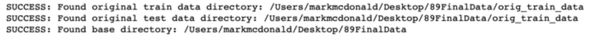

# Introduction 
---

In recent years, autonomous vehicle navigation has been focused on road-based vehicles. This popularity is warranted by the enormous demand for safe and reliable travel and will continue to progress. Advances in robotics have extended beyond being able to assist humans with road-based travel needs. Modern robots have the ability to maneuver over complex natural landscapes like humans and animals can do. This brings the benefits of automated machinery to a much broader scope of applications such as farming, military, security, search and rescue, etc.

The PathFinder project aims to teach off-road autonomous vehicles how to determine navigable paths. PathFinder is a deep learning-based application that will develop a heatmap from an image of a landscape that highlights navigable areas.

**Problem Statement:**
*“Provide ground-based autonomous vehicles and robots support with understanding their surroundings in order to select an adequate navigable path using a model of Autoencoders and Convolutional Neural Networks trained using Keras with a sample videos from a variety of landscapes and lighting conditions.”*

# Overview 
---

The project is the result of an academic assignment at Harvard Exetnension's "Deep Learning" course.  The execution of the project is divided into 3 distinct efforts;

> 1.  data handling
> 2.  model development and training,
> 3.  using the model to display the heat maps

The training data for the model will originate from <http://www.mikeprocopio.com/labeledlagrdata.html>. The initial research project was focused on enhancing robotic navigation using stereoscopic visual which is beyond the scope of this project. The PathFinder project will be limited to identifying a path of travel with a single-plane image.

The source data is packed into various series of MAT files which include various elements of data for each frame in a video sequence. After downloading the data, some of this data is extracted and used for training and testing the PathFinder application. The training data includes an image and a mask that highlights navigable areas. The testing data includes images without any mask.

Each MAT file represents a single frame of video. The image files need to be extracted and stitched together in order to create a contiguous video. The video is a sequence showing the navigation of a path. The PathFinder program will create videos with mask overlays that show the navigable elements of the scene. Training will produce model weights that can be applied to other images.  For testing, the mask will be generated by the model weights and compared to the human generated masks.

The amount of data images available is limited, so training will rely on augmentation.

After several trial and errors, the final model chosen to train the network is an AutoEncoder using CNN layers, image augmentation, no regularization and is trained on color images.

Once training is complete, the trained model will be used to produce a heatmap that highlights navigable areas of a test video sequence.

# Description of Technology
---

Pathfinder is based on Python.  A Jupyter master notebook relied on various support scripts to train and test the model.

Keras is used to develop and train models. CNN layers are stacked to create an encoded layer that is expanded back to the original size except the expanded image represents a mask that highlights navigable areas.

Data generstors are used extensievely to produce augmented triaining data. 

OpenCV is used to produce video output.

# Description of Hardware
---

**Computer**: iMac (Retina 5k, 2017)

**Processor**: 4.2 GHz Intel Core i7, 24GB

**GPU**: Razer Core X Case with AMD Radeon RX Vega 64 External GPU Card

Using a GPU is imperative to process the data in this project. When attempting to execute some of the steps using CPU’s, the kernel would fail.

Since macOS Mojave, macOS only supports AMD GPU cards. TensorFlow only works on Nvidia cards so in order to use Tensorflow with a GPU, macOS HighSierra or earlier is needed. In order to use an eGPU with macOS Mojave, the PlaidML backend with Keras is necessary. As a result, the master notebook includes a line that will enable the PlaidML backend for Keras. This can be commented out as needed but can be left as-is without problems. If running the project where an Nvidia eGPU is used, this line should be commented out.

# Description of Data
---

Data for this project should be downloaded from the orginal source.  Since the data set is large (~7GB), data is not included with the project executables.  

Training and Test Data:
    <http://www.mikeprocopio.com/labeledlagrdata.html>

The original dataset includes 6 training videos each having a sequence of 100 frames for a total of 600 training images. The images for each video are in a separate directory in the dowloaded data.  Each frame of the test sequences has a corresponding labeled overlay which will be referred to as a mask. Each pixel of each mask is marked as either ‘ground plane’ = 0, ‘obstacle’ = 1 or ‘unidentified’ = 2.

Each of the test scenes has a total of 500 frames each with no overlay information.

## Frame Files

Each downloaded data directory contains several files where each file represents a frame of video. The file format of each frame is “\*.mat” which includes several pieces of extractable information related to the frame. The data in each MAT file is a dictionary with the following keys:

        __header__
        __version__
        __globals__
        im_disparity
        im_rgb
        stereo_diff_disparity
        stereo_disparity_valid
        stereo_max_disparity
        stereo_min_disparity
        frame_number_a
        frame_number_b
        frame_number_c
        image_timestamp
        extract_timestamp
        extract_author
        extract_version
        stereo_mask_precalc
        feature_image_precalc
        manual_human_labeling_mask

For the scope of this project, we will focus on the data in <code>im_rgb</code> and <code>manual_human_labeling_mask</code> where the <code>im_rgb</code> data is the source image and the <code>manual_human_labeling_mask</code> data is the respective mask

The <code>im_rgb</code> data frames have a resolution of 640x480 with 3 color layers (RGB Tensorflow ordering).

The <code>manual_human_labeling_mask</code> frames have a resolution of 640x480 with 1 layer.

Each frame will be treated as a unique image for training purposes and not as a sequential video. For this series of images (which can be combined to make a video), the outcome of any frame is not dependent on the previous one so no sequential analysis is performed. Each frame can be considered a unique image and training does not need to be sequential.

 

 
Figure : Applied mask overlay

 

## Modifications to Mask Data

Masks from the original data set include a label for each pixel of 0,1 or 2 (‘ground plane’ = 0, ‘obstacle’ = 1 or ‘unidentified’ = 2).  For this project, we are only interested in things that are ground plane or not. If something is unidentified, we will assume that it is not navigable. Since we are looking for a path, we don’t want it to be labeled with 0, but rather with a 1. In order to achieve this, we will need to change our masks so that they are composed of 0’s or 1’s only and so that the 1 represents the path.

This makes the masks binary and reduces the amount of data that needs to be processed.

## Directory Structure

The instructions below will explain how to setup an initial directory structure for the program data.  The downloaded data and the program files do not need to be in the same directory structure. Upon executing the program, a series of support directories will be created in the data directory.  The downloaded data will be used to create training and validation data sets of images and masks. The setup process will also create a series of videos for each of the training sequences. A ‘results’ directory will be created to store training results.

# Installation, Configuration and Setup 
---

## A – Download Source Data

Data for the training comes from <http://www.mikeprocopio.com/labeledlagrdata.html> where research was done on robotic navigation over natural terrain using stereoscopic vision.

Train and test data is extensive at over 7GB. Data must be stored locally for training. Access over a network or the Internet will be too slow.

Downloaded data will be in 9 directories. 3 directories labeled with “SupplimentalFrames” are test data. The video frames in the test data directories are sequential to the training data so that when they are stitched together, they create a seamless sequence. The training data is in the remaining 6 directories ending with 4 characters, e.g: “DS1A”. “DS” represents “data sequence” and the “1” represents the scene number and the “A” represents the lighting condition. The test directories also contain a corresponding tag that indicates which training sequence it is aligned with.

**Move Downloaded Data into the Following Local Data Structure**
 

 
Figure : Each directory represents a video sequence where the name represents the scene and lighting conditions.
 
E.g. “DS1A” – Data Sequence 1 Scene A

 

After downloading data, directories for <code>train</code> and <code>test</code> must be manually created.  The downloaded data will need to be moved to these directories by the user.  In the screenshot above, the directories <code>89FinalData</code>, <code>orig_test_data</code> and <code>orig_train_data</code> were manually created.

Any reasonable name can be chosen for these directories. The names of these directories will be specifically referenced with a variable in the main Jupyter script.  

## B – Download Application

Clone the git repository using:

    git clone https://github.com/mcdomx/pathfinder.git

Once cloned, the application includes the following files in the <code>code</code> directory:

    master_pathfinder_notebook.ipynb
    create_superimposed_video_from_MP4.ipynb
    create_video_from_pickle_file.ipynb
    data_preprocess.py
    models.py
    video_support_processes.py

The file <code>master_pathfinder_notebook.ipynb</code> is a Jupyter notebook that is used to drive the entire process including data setup, training and testing. 

<code>create_superimposed_video_from_MP4.ipynb</code> is designed to demostrte the completed model by creating a superimposed video based on any existing MP4 video (of an outdoor path environment)

<code>create_video_from_pickle_file.ipynb</code> is designed to create a superimposed video based on a series of unmasked jpeg files which represent frames of a video.

Supporting scripts are used as imports in the master notebook to keep the notebook as concise as reasonable.

    data_preprocess.py   # handles data preparation steps.
    models.py    # defines data generators and the model used to train the network.
    video_support_processes.py   # creates superimposed videos based on training and test data.

## C – Run Master Notebook

Once the data set is moved to training and test directories and the application is cloned, the program can be executed.

Start Jupyter notebook named <code>master_pathfinder_notebook.ipynb</code> from the ‘code’ directory.

From terminal:

    cd ‘full/path/to/application/directory/code’
    jupyter notebook

Each of the following steps are shown in detail in the **demonstration** section.

Open the <code>master_pathfinder_notebook.ipynb</code>

### STEP 1 - Set Backend For GPU Support

In the notebook, the following line is optional based on your local GPU capabilities. If you are using an Nvidia GPU, the line used to set the backend can be commented out. Using PlaidML is necessary to use an AMD external GPU on masOS Mojave.

    \# OPTIONAL SETTING
    \# Here we override the keras backend env variable to use plaidml
    \# plaidml can make use of AMD GPUs
    \# This assignment needs to be added before loading keras libraries
    os.environ\["KERAS_BACKEND"\] = "plaidml.keras.backend"
    \# to install plaidML, activate appropriate environment and then:
    \# pip install -U plaidml-keras
    \# plaidml-setup

### STEP 2 - Check that you are in the correct current directory

Here we must ensure we are in the correct directory.

If in the correct directory, support scripts are imported.

        pwd = !pwd
        if pwd[0][-4:] != "code":
            print("ERROR: You're currently not in the project's code directory.")
            print(pwd[0])
        else:
            print("SUCCESS: You are in the 'code' directory")
            print(pwd[0])
            import data_preprocess as pf_preprocess
            import models as pf_model
            import video_support_processes as pf_video

 

 

### STEP 3 - Set Variables

Here we set local directories for our downloaded data. The highlighted directories were created after downloading data in **STEP A** above. The validation split can be changed , if desired.

This is where data downloaded from http://www.mikeprocopio.com/labeledlagrdata.html should exist:

    original_train_dir = '.../89FinalData/orig_train_data'
    original_test_dir = '.../89FinalData/orig_test_data'

This is where directories containing data extracted from original data will be placed:

    base_dir = '.../89FinalData'

'val_split' is the percentage of validation data which is taken from the test data:

    val_split = .20

 

 

Now, we can set the supporting directory structure in our application. The ‘True’ argument is used to delete and recreate directories that already exist. During development, ‘False’ avoids recreating data when we only need to set variable names for the directories:

Here we establish the supporting directories for our training and validation data.  The True parameter will erase any pre-existing data in the directries.  Setting this parameter to False will only set the variables:

    train_dir, train_video_dir, val_dir = pf_preprocess.set_directories(base_dir, True)

 

 

**The Data Directory Structure After Step 3**

 

 
Figure : Data Directory Structure

 

### STEP 4 - Extract Data From Downloaded Files

Now that directories are setup for our training, images and masks are extracted from the downloaded \*.mat files. We run an extraction method on the training set and the test set.

    pf_preprocess.create_img_and_mask_data(original_train_dir, train_dir)

Note that masks won't be created for the test directories.

    pf_preprocess.create_img_and_mask_data(original_test_dir, test_dir)

 

 

This process extracted an image and a mask from each of the files from the original data set. Each image and mask pair is saved into a respective directory where they are accessed for training and validation. Additionally, the test video sequence images are extracted and saved.

Now, we can move some of the extracted images into a validation set of directories:

    pf_preprocess.create_val_set(train_dir, val_dir, val_split)

 

 

### SIDEBAR: Understanding the data set

Let’s take a moment to understand the data that we are working with.

#### MAT File Structure

The downloaded data is a series of MAT files. These are simple data files with a dictionary of data elements. We can view the dictionary keys:

    import scipy.io
    mat_file_path = os.path.join(original_train_dir, 'labeled_lagr_data_640x480_DS1A/frame001.mat')
    mat_file = scipy.io.loadmat(mat_file_path)
    for k in mat_file.keys():
        print(k)

 

 

We observe several elements of data in the MAT files, but for this project, only the <code>im_rgb</code> and <code>manual_human_labeling_mask</code> items are necessary. The <code>im_rbg</code> item is an array that represents the base image and the <code>manual_human_labeling_mask</code> is the respective mask.

One MAT file exists for every frame of video:

 

 

The frames are separated into directories where each directory is a different scene. We observe 6 scenes in our training set. The 6 scenes are in 3 settings with 2 different lighting conditions for each.

After running the data extraction script, we have images and masks in supporting directories from each of the frames:

 

 

The <code>data</code> directory is necessary for the data generators that we will use to generate batches during training.

Each jpg file is prepended with the scene name.

Each jpg has a corresponding mask file with the same name:

 

 

The masks don’t preview because they only have 1-channel.

We can observe the data stored im the <code>im_rgb</code> dictionary element.

Original images are 640 x 480 (note that this is a vertical format):

    orig_image = mat_file\['im_rgb'\]
    print("Image Shape: ", orig_image.shape)

 

 

Masks are the same size as the images but only one channel.

    orig_mask = mat_file\['manual_human_labeling_mask'\]
    print("Mask Shape: ",orig_mask.shape)

 

 

The original data is 640 x 480. We will make this smaller to train. Note that these are in vertical format. These are rotated when extracted.

The mask data ranges from 0 to 2.  PathFinder is designed to work with masks having values of 0 and 1, where 1 represents navigable areas.

This conversion will be made in that master notebook in Step 6 below.

### STEP 5 - Create a superimposed video file based on original data

In order to visualize the training and validation data, a video of superimposed masks is displayed.

Before making any changes to our data, we will create a video for each scene that superimposes the mask over the image. The superimposed data represents areas for safe navigation:

    pf_video.create_superimposed_video_from_MATFiles(original_train_dir, train_video_dir)

 

 

A screen shot of one of the videos is displayed below:

 

 
Figure : Frame from video of superimposed mask from training set

 

This is a perfect mask created manually by a person. Pathfinder will attempt to recreate the green area of the mask.

### STEP 6 - Change the mask data to Binary Values

The initial masks from the data set contain more data than is needed. To simplify training, we will create masks with only 0’s and 1’s.

We make these changes in-place, so our original mask data is destroyed. After creating the superimposed videos, we no longer need this data. We use a support script to do this for us. The new masks have a 1 place for every navigable place in the image. The rest is filled with zero’s.

    pf_preprocess.convert_jpg_mask_to_binary_mask(os.path.join(train_dir, 'masks'))
    pf_preprocess.convert_jpg_mask_to_binary_mask(os.path.join(val_dir, 'masks'))

 

 

A test superimposed single image is created to see that the conversion works properly. Since this is repeated later, a support function is created:

    from keras.preprocessing import image as kimage
    def display_overlay(image, mask, ispath=True):
    if ispath:
        image = kimage.load_img(image)
        mask = kimage.load_img(mask)
        image = np.uint8(image)
        mask = np.asarray(mask)
        noneType = type(None)

    if type(mask) != noneType:
        \# make red layer for mask
        mask = np.moveaxis(mask, 2, 0)
        new_mask = np.zeros((3, mask.shape\[1\], mask.shape\[2\]))
        new_mask\[0\] = np.array(mask\[0\]==0)\*180
        new_mask\[1\] = np.array(mask\[0\]==1)\*180
        new_mask = np.moveaxis(new_mask, 0, 2)
        image = np.uint8(new_mask\*.3 + image\*.7)

    if image.shape\[2\] != 3:
        image = np.uint8((np.zeros(shape=(360,480,3))) + image)
        plt.imshow(np.uint8(image))

Pull an image and a mask and display them:

    imagefiles = sorted(os.listdir(os.path.join(train_dir, 'images', 'data')))
    maskfiles = sorted(os.listdir(os.path.join(train_dir, 'masks', 'data')))
    test_image = os.path.join(train_dir, 'images', 'data', imagefiles\[0\])
    test_mask = os.path.join(train_dir, 'masks', 'data', maskfiles\[0\])
    display_overlay(test_image, test_mask, ispath=True)

 

 
Figure : Example of masked image after making masks binary

 

The result is reasonable.

Now, data is ready to be trained.

### STEP 7 – Model Training

Training will rely on data generators for both the training and validation images. Augmentation is used because the data set is small. Using augmentation on the images poses a small challenge since the masks will need to be identically augmented. The support script <code>models.py</code> handles this and includes data generators for both the training images and the validation images.

#### Training

The training steps include several processes: 

+ Models are trained using a loop to accommodate training multple model unattended.
+ The model is compiled using the optimizer and loss functions stored in the description dictionary.
+ A Tensorboard directory for this model so that it can be viewed separately from other trained models.
+ Data generators are retrieved for training and validation and Keras <code>fit_generator()</code> method is used to train taking advantage of the generators.
+ A text overlay is created for the final video output.
+ A pickle file is created for each trained model so that the training variables can be stored fro subsequent use.
+ Finally, an overlaid video is genersted using the trained model.

After training of each model is complete, a summary statement will show where the video was saved.

#### View Training Data Charts in Tensorboard

Training progress can be viewed in Tensorboard. Here, only the <code>epoch_val_loss</code> is shown as it is most indicative of the training progress:

From terminal:

    cd &lt;directory to project&gt;/code
    tensorboard --logdir=‘./logs’

 

 
Figure : Example of tensorboard output

 

#### View Video

We can navigate on our local computer to the results directory that was created in our data directory. In that directory, we find a sub-directory for each model that was trained. In that directory, we find 2 files; 1) data.pickle and 2) an mp4 video file.

 

 

The pickle file includes a tuple of the description and trained model weights. The mp4 video file is a video of all test data sequences with an overlay generated by our model. Below is a screen shot of a sample video:

 

 Figure : Frame of video after mask created from the trained model is applied

 

### Independent Test of External Video

The superimposed video output is based on test data from the original dataset. I wanted to see how this would work on a video that was not part of the dataset. The script ‘create_superimposed_video_from_MP4.ipynb’ will take any MP4 video and extract the frames into image files that can be used with the model. The output was impressive, below is a screenshot:

 

 
Figure : Example of masked image from external video not part of training data

 

# Summary
---

The initial model that was used was based on the Reuters multi-class classification example. The idea was that the mask represents a series of 0’s and 1’s where each classification represents a mask pixel. I tried this using a small 30x40 mask, but had limited success. It worked, but was not acceptable.

I moved to an autoencoder model with the idea to encode an image and decode it as a mask. Using CNN layers in the encoder, I attempted to capture features of the image that could be encoded and then when decoding, certain features would turn on mask pixels or not. This proved more effective.

The final model still has limitations. I suspect that by adding layers to the model, I could see better results. Since the chosen model design worked, I chose to focus on changing the parameters to make the model work better. I made several observations that brought me to the final combination of parameters:

-   Training with color images was better than black and white

    -   I suspect that the color of objects helped to identify obstacles

-   Final activation of ‘relu’ was much better than ‘sigmoid’

    -   The complexity of the landscape makes some areas more likely to be paths or obstacles. Using ‘relu’ takes this probability into account.

-   More epochs were not better

    -   I continually tried to extend training by hundreds of epochs running overnight. This never created a better model. I found the optimal number of training epochs to be around 30-40.

-   Skewed and shifted augmentations did not work well

    -   When skewing images, some areas are filled in. Although the masks match this skewing, the filled in areas never looked like paths not obstacles and only limited the mask space that was displayed. Instead, zoom, rotation, and flipping were used.

-   Regularization did not work

    -   No matter how small or large the l2 lambda value used, results became speckled.

-   A single Dropout layer proved best

    -   Adding multiple dropout layers was not helpful. A single layer at the top of the model was the best option.

The next steps to improve this are to experiment with different model designs. This could include additional layers as well as changing the type of model. For the scope of this effort, additional model designs were not explored.

Another area to explore would be to specifically identify hazards like trees, rocks, lakes, cliffs and kittens so that the model could explicitly make those areas of the image non-navigable.

# YouTube Video Links
---

**2-Minute Video Link**: <https://www.youtube.com/watch?v=YpPW69S8C2M>

**Detailed video link**: <https://www.youtube.com/watch?v=1XsFCXq8SQA>

# References
---

Data set:
    Michael J. Procopio, Hand-Labeled DARPA LAGR Datasets, <http://www.mikeprocopio.com/labeledlagrdata.html>, 2007
